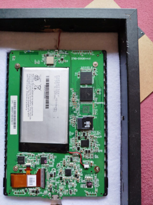

### !!! THIS README IS NOT YET COMPLETE

  |  

### TL;DR
Reporpousing an old Kobo with a wonderful eink display; it automatically downloads the new picture once a day and refreshes the screen. (currently it has to be "awakened" with a magnet or by pressing the button, when needed.)

### How it can be installed on kobo devices
It has been tested on my device only (which is a GloHD), but *it should* "just work" on any other kobo ereader... at least with the same or almost firmware (which is 4.56). 

## Upgrade and/or activate the old kobo
### ### make wifi always on

You first need devmode enabled to continue. Just type "devmodeon" in the searchbar and hit enter. Or you can directily plug the device into a pc, since we would need it for the wifi thing, and edit the KoboeReader.conf file in /kobo/Kobo folder, adding these lines:

    EnableDebugServices=true
    
    ForceWifiOn=true 

So, the second of the two lines above keeps WiFi always on, which was the point. Do not unplug yet.

You can check the devmode is effectevely enabled in Settings > Device Information and you should see a label for that.
### create screensaver folder
In the root of your connected device, show hidden directories and go to /kobo (if not there already) and create a new folder named exactly "screensaver". Therefore the patht should be /kobo/screensaver.

### create .photoframe folder and paste scripts
Download the zip file with the 2 scripts up here.
On your connected device, go to the files root and create a folder named exactly ".photoframe" and inside it paste the scripts.

### set book cover on fullscreen
Go to device Settings > Cover and set the book cover to fullscreen, then disable read controls.

### install niluje's stuff
We need this collection of packages for a multitude of reasons, to make it work.
It can be downloaded from here (and here the original thread). Thanks to Niluje.
Back to work, unzip the package and place the KoboRoot.tgz file in your /kobo directory and safely unplug the device from the pc.
Now your Kobo should detect it and automatically install it, just let it be.
Once it is rebooted we should be set.

